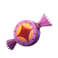

  

<h1 align="center">Calculator for Carnival Candyworks</h1>

  An open-source calculator for Dota 2 Candyworks.
   
  Find an efficient exchange path to the candy you need.

  Open the calculator: <a href="https://www.candyworks.site"><strong>www.candyworks.site</strong></a>.

---

## Official Deployments

| Site | Address |
| --- | --- |
| Primary | **[www.candyworks.site](https://www.candyworks.site)** |
| Alternative | [tinykiecoo.github.io/Calculator-for-Carnival-Candyworks](https://tinykiecoo.github.io/Calculator-for-Carnival-Candyworks/) |

> [!NOTE]
> These are the only deployments maintained by the author. Similar-looking tools hosted elsewhere may be third-party redeployments.

## Run Locally

Clone or download the repository, then open `index.html` in a modern browser.

## Repository Structure

| Path | Purpose |
| --- | --- |
| `index.html` | Application and GitHub Pages entry point |
| `candywork-assets/` | Local images, fonts, and other interface assets |
| [`DISCLAIMER.md`](DISCLAIMER.md) | Fan-project and affiliation disclaimer |
| [`THIRD_PARTY_NOTICES.md`](THIRD_PARTY_NOTICES.md) | Third-party asset and trademark notices |
| [`LICENSE`](LICENSE) | License for the original source code and documentation |

## Disclaimer

This is a free, open-source, non-commercial fan project and is not affiliated with Valve, Steam, or Dota 2.

It uses Dota 2 / Valve-derived images, fonts, names, and UI materials. Those materials remain the property of Valve and their respective rights holders; this project's open-source license does not grant rights to them.

Official deployment website uses third-party visit counters. The public counter value can be viewed [here](https://www.busuanzi.cc/count.php?search=www.candyworks.site).

## License

Original source code and documentation in this repository are released under the [MIT License](LICENSE). Third-party trademarks, game files, images, fonts, and other assets are excluded.
